# link
https://viblo.asia/p/git-hoc-nghiem-tuc-mot-lan-phan-1-OeVKBo6JZkW
https://viblo.asia/p/nhung-lenh-git-co-ban-can-nho-V3m5W1OyZO7
https://viblo.asia/p/mot-so-truong-hop-khi-su-dung-git-3Q75w1x7ZWb

(tham khao Notion, trc co note Youtube, bai hd...)


Tài liệu tham khảo:
 https://git-scm.com
https://backlog.com/git-tutorial/vn/


# Git - Học nghiêm túc một lần (Phần 1)


## 1. Mở đầu
Bạn là một lập trình viên:
- Đã bao giờ bạn vô tình làm các dòng **code rối tung** lên hay vô tình xóa các file đi và chương trình gặp lỗi.
- Vậy làm sao để **hoàn nguyên code về trạng thái cũ**, chẳng nhẽ lúc nào cũng tạo bản backup, 10 lần backup là 10 bản.

Bạn là một lập trình viên:
- Bạn tham gia trong một dự án, bạn muốn **cập nhật sự thay đổi** code của thành viên khác một cách nhanh chóng
- Chẳng nhẽ cứ sao chép code vào usb rồi gửi cho nhau như hồi mới vào nghề.

Quá bất tiện và dễ gây sai sót, nhu cầu đó thúc đẩy:
- Tạo ra công cụ giúp **quản lý phiên bản của source code**
- Và từ đó, Hệ Thống Quản Lý phiên bản (Version Control System - VCS) ra đời.

## 2. Tiến hóa
Cùng đọc lịch sử chút nào: Với vấn đề trên, từ lâu người ta đã xây dựng các phiên bản VCS cục bộ:
- Chứa một database đơn giản.
- Lưu trữ lại mọi sự thay đổi.

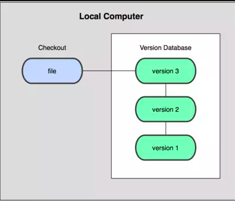

Nhưng bài toán **kết nối** với các lập trình viên khác thì vẫn chưa giải được.

- Vậy là **Hệ Thống Quản Lý Phiên Bản Tập Trung (Centralized Version Control Systems - CVCSs)** được phát triển, với một vài cái tên như CVS, Subversion, và Perforce.
- Mô hình này bao gồm 01 máy chủ có chứa tất cả các file đã được **phiên bản hoá** kèm theo danh sách các máy khách có quyền thay đổi các tập tin này trên máy chủ trung tâm đó.

Trong một thời gian dài, mô hình này thực sự là **tiêu chuẩn** cho việc quản lý phiên bản.

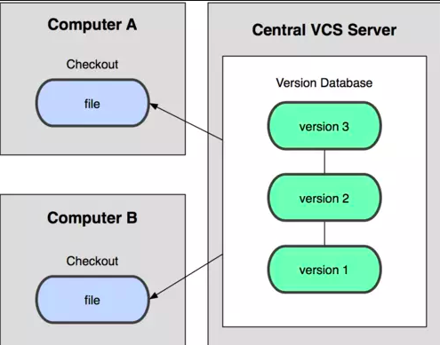

Nghe có vẻ đã ổn khi mà các thành viên trong team đã có thể kết nối với nhau nhưng có một vấn đề xảy ra.
- Đó là khi ***máy chủ gặp sự cố***, các thành viên chẳng thể kết nối với nhau.
- Nếu ổ cứng máy chủ bị hỏng, các bản sao lưu dự phòng của máy chủ chưa kịp backup thì thông tin sẽ bị thất thoát, thậm chí là mất tất cả.

Đã tới lúc cần tới các **Hệ Thống Quản Lý Phiên Bản Phân Tán - (Distributed Version Control Systems - DVCSs)**.
- Trong các DVCS (ví dụ như `Git`, Mercurial, Bazaar hay Darcs) ***các máy khách sao chép toàn bộ kho chứa (repository)***
- Chính vì vậy, chúng ta luôn có những bản sao đầy đủ của tất cả dữ liệu

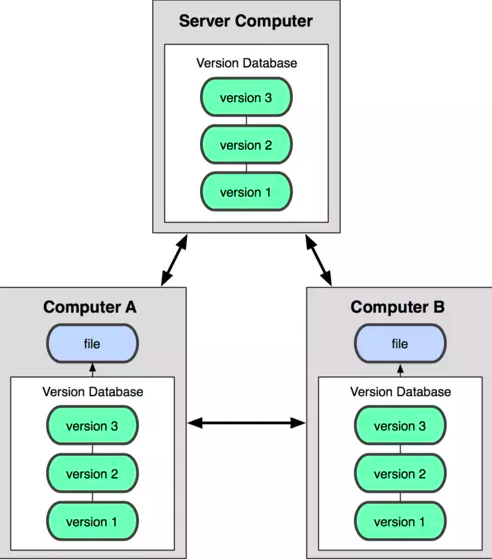

Ngoài ra, DVCSs còn giải quyết được bài toán quản lý nhiều kho chứa từ xa, khi đó còn có thể cộng tác với nhiều nhóm người khác nhau theo những cách khác nhau trong cùng một dự án.

## 3. Git - Sự kiện

Có thể bạn sắp biết, dự án phần mềm mã nguồn mở nhân của Linux có một phạm vi khá lớn.
- Kể từ năm 2002, dự án này sử dụng `BitKeeper - một DVCS độc quyền`.
- Vào năm 2005 định mệnh đó, con thuyền giữa cộng đồng phát triển nhân Linux và công ty thương mại phát triển BitKeeper bị phá vỡ, và công cụ đó không còn được cung cấp miễn phí nữa.
- Chính lý do này đã thúc đẩy cộng đồng phát triển Linux (chính xác hơn là Linus Torvalds, người sáng lập ra Linux) phát triển công cụ của riêng họ dựa trên những bài học từ việc sử dụng BitKeeper.
- Và `Git đã ra đời` như vậy, một công cụ nhanh kinh ngạc, thiết kế đơn giản, phân tán toàn diện.
-  Có khả năng xử lý các dự án lớn giống như nhân Linux.
- Mạnh mẽ và được đông đảo developer sử dụng.

Giả sử như ngày xửa ngày xưa con thuyền tình ái giữa cộng đồng phát triển Linux và công ty thương mại phát triển BitKeeper không tan vỡ.
- Thì giới coder bây chừ đâu có Git ngon nghẻ thế này mà sài free nhỉ.
- Thế nên các bác nào mới chia tay gấu thì đừng buồn nha, biết đâu đó lại là điềm lành.

## 4. Git - Overview

Nếu như bạn đã từng sử dụng Git thì chắc hẳn lắm lúc cũng đã từng nóng gáy để fix lỗi về Git.

Cho dù là lần đầu học về Git hay đã từng sử dụng, thiết nghĩ rằng bạn nên

- Hiểu rõ hơn **bản chất** của Git là gì
- Các **nguyên tắc cơ bản và follow làm việc** của Git
- Rồi sau đó mới nên học tới các **câu lệnh**
  
=> Thì bạn sẽ sử dụng Git một cách hiệu quả và dễ dàng hơn cho bạn rất nhiều.

### Khi học Git:
- Hãy cố gắng gạt bỏ những kiến thức mà có thể bạn đã biết về các VCS khác, ví dụ như Subversion và Perforce; việc này sẽ giúp bạn tránh được sự hỗn độn, bối rối khi sử dụng nó.
- Chung quy lại, các câu lệnh dù rất nhiều nhưng cũng chỉ biến tấu từ những điều cơ bản mà ra. Nắm phần gốc là sẽ làm chủ được phần ngọn, bằng không, chúng ta sẽ nhớ câu lệnh khá khổ sở và sau này có gặp bug cũng chẳng biết phải fix kiểu gì (vì chẳng hiểu bản chất nó tại sao lại thế).
- Chỉ lên google search vài câu lệnh cơ bản như add, commit, pull, push, merge, rebase,... rồi chạy thì không ổn, sẽ như kiến bò trên chảo nóng sớm thui à (Hình ảnh của mình hồi năm 3 đại học).

Dưới đây là hình ảnh trang chủ của Git https://git-scm.com/
- Có 4 mục lớn bao gồm About, Documentation, Downloads và Community.
- Nếu như bạn đọc, hiểu rõ và thực hành hết tất cả những điều nói trong trang này thì xin chúc mừng, bạn sẽ trở thành master Git sớm thôi.
- Còn phạm vi bài viết sẽ tập trung vào phần About và Document

Sau đây mình xin tóm lược những điều cơ bản về Git kèm theo một vài kinh nghiệm khi sử dụng Git mà mình đã tích lũy
Hi vọng sẽ giúp các bạn dễ dàng tiếp cận hơn và cảm thấy thư thái hơn khi sài Git.

## 5. Git - About
### Điểm khác nhau cơ bản giữa Git với các VCS khác là cách Git `nghĩ` về dữ liệu.

Phần lớn hệ thống khác lưu thông tin dưới dạng
- Các tập tin được thay đổi,
- Coi thông tin được lưu trữ như là một tập hợp các tập tin
- Các thay đổi được thực hiện trên mỗi tập tin theo thời gian.

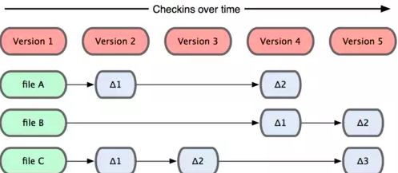

Còn Git sẽ xem dữ liệu của mình giống như
- Một tập hợp các "ảnh" (snapshot) của một hệ thống tập tin.
- Mỗi lần bạn lưu lại trạng thái hiện tại của dự án, về cơ bản Git "chụp một bức ảnh" ghi lại nội dung của tất cả các tập tin tại thời điểm đó và tạo ra một tham chiếu tới "ảnh" đó.
- Để hiệu quả hơn, nếu như tập tin không có sự thay đổi nào, Git không lưu trữ tập tin đó lại một lần nữa mà chỉ tạo một liên kết tới tập tin gốc đã tồn tại trước đó.

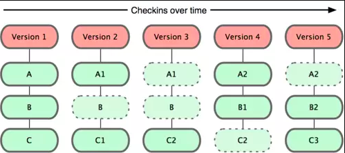

### Còn đây là cách Git `làm` với dữ liệu
Git chỉ thêm mới dữ liệu
- Dữ liệu của repository sẽ được lưu trong thư mục `.git`.
- Khi bạn thực hiện các thao tác trong Git, phần lớn các hành động đó đều được thêm vào cơ sở dữ liệu của Git.
- Rất khó để yêu cầu hệ thống thực hiện một hành động nào đó mà không thể khôi phục lại được hoặc xoá dữ liệu đi dưới mọi hình thức.
- Giống như trong các VCS khác, bạn có thể mất hoặc làm rối tung dữ liệu mà bạn chưa commit; nhưng khi bạn đã commit thì rất khó để mất các dữ liệu đó, đặc biệt là nếu bạn thường xuyên đẩy (push) cơ sở dữ liệu sang một kho chứa khác.
- Bạn có thể thoải mái thử nghiệm mà không lo sợ sẽ phá hỏng mọi thứ.

### Dựa trên phần thiết kế lõi này, Git có những  `ưu điểm vượt bậc` khác, cùng tìm hiểu dần nhé !

Git ưu ái dành phần đầu tiên: `About` này để giới thiệu và khoe ra điểm mạnh của mình.
Mà cái gì cũng thế, cứ phải thấy được điều tốt đẹp của nó thì mới có động lực để tìm hiểu
Kiểu như gặp bạn nữ xinh xắn đáng eo thì mới có động lực để theo đuổi vậy.

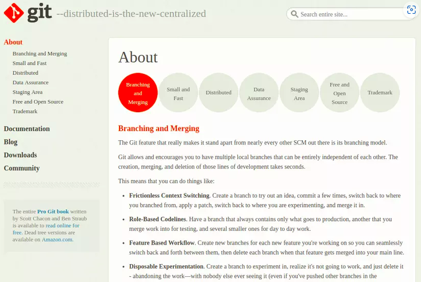


#### Branching and Merging

**Thế nào là `repository` ?**
`Repository` (hay gọi tắt là `repo`) được hiểu đơn giản là một kho chứa toàn bộ project bao gồm source code và lịch sử thay đổi cũng như nội dung thay đổi của từng file và từng cá nhân đóng góp cho project đó, gồm 2 loại là:
- `Remote repository`: Kho này dùng để chia sẻ cho nhiều người và được đặt trên server chuyên dụng.
- `Local repository`: Kho này được đặt trên máy của bạn và chỉ dành cho một người mà thôi.

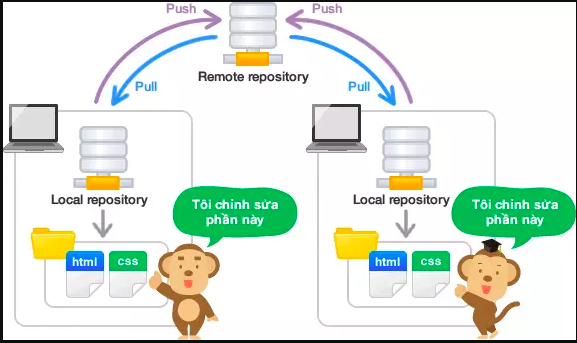

**`Branch` là nhánh của repository:**
- Các nhánh sẽ **độc lập** với nhau và phát triển một **tính năng hoặc làm 1 nhiệm vụ** nào đó, không gây ảnh hưởng đến các nhánh khác.
- Khi các nhánh hợp nhất lại với nhau thì gọi là `merge`, thông thường, nhánh mặc định là `master`.
- Branch ở trên local repo thì gọi là `local branch`.
- Branch ở trên remote repo thì gọi là `remote branch`.
- Một `local branch` có thể ***liên kết với 1 hoặc nhiều*** `remote branch` hoặc ***không*** branch nào cả.
- Git cho phép và khuyến khích bạn tạo nhiều `branch tại máy tính cá nhân` của bạn, việc tạo, sáp nhập và xóa bỏ những branch này diễn ra rất nhanh chóng.

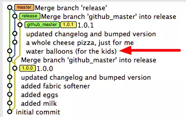

- Thông thường thì `branch master` chứa phiên bản code chạy ngon ngẻ nhất để **deploy lên production**,
- `Branch dev` để bạn có thể **kiểm thử** lại chức năng
- Một vài branch nhỏ để **xây dựng** các tính năng mới.
- Sau khi viết code để thực hiện chức năng mới ở branch nhỏ xong, bạn hợp nhất (`merge`) code vào branch dev, tiến hành kiểm thử, nếu ok thì tiếp tục merge code từ dev vào master.
- Việc chuyển đổi trạng thái code từ branch này sang branch khác hoàn toàn dễ dàng, nếu như chức năng mới của bạn bị lỗi, bạn hoàn toàn có thể `xóa branch đó đi mà chẳng gây ảnh hưởng những chức năng khác`.

Follow cơ bản là vậy, trong dự án thì có thể tùy biến ít nhiều.

#### Small and Fast

Git chứng tỏ rằng mình rất nhẹ và hoạt động nhanh chóng vì những lí do sau:
- Gần như tất cả các hoạt động được thực hiện tại máy tính cá nhân nên Git có một `lợi thế tốc độ` rất lớn so với các hệ thống mà liên tục phải giao tiếp với một máy chủ ở đâu đó.
- Git được viết bằng `C`, làm giảm tổng phí thời gian chạy liên quan đến ngôn ngữ cấp cao hơn.
- Ban đầu Git được xây dựng để làm việc trên `hạt nhân Linux`, **tốc độ và hiệu suất** là một mục tiêu thiết kế chính của Git ngay từ đầu.
- Họ có dẫn ra một vài biểu đồ để so sánh Git với SVN, gọi là có chút số liệu để tăng tính thuyết phục (cột bé hơn thể hiện là nhanh hơn)

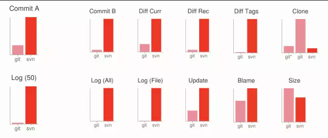

#### Distributed: Phân phối

**`Backup`: Một trong những tính năng hấp dẫn nhất của bất kỳ DSCM nào, trong đó có Git**
- Mỗi người dùng đều có thể tạo một `bản sao lưu đầy đủ` dữ liệu trên máy chủ chính về máy tính cá nhân của mình, gọi hành động này gọi là `clone`.
- Mỗi bản sao này có thể được `đẩy lên (push)` để thay thế máy chủ chính trong trường hợp rủi ro nào đó hoặc có thể liên tục `cập nhật (pull)` về những thay đổi từ máy chủ mọi lúc.

**Chúng ta sẽ nói tới 2 `workflow làm việc với Git` thông dụng nhất**:
**Subversion-Style:**
- Tạm dịch là `kiểu lật đổ`, minh họa như hình bên dưới
- Developer `clone` shared repository về máy của mình, cập nhật code
- Sau đó `add`, `commit` rồi `push` lên shared repository.
    - Mỗi một commit sẽ đính kèm theo một  `message` mô tả sự thay đổi của code, tức là chú thích bạn vừa thay đổi gì.
    - Như vậy mỗi khi bạn commit thì Git sẽ nhận ***code thay đổi và message mô tả ngắn gọn*** sự thay đổi đó.
    - Mỗi một lần `commit` là một lần `lưu lại trạng thái của code dưới local`.
    - Còn để người khác có thể nhìn thấy được sự thay đổi đó thì cần `push lên server (remote branch).
- Lưu ý là Git sẽ không cho phép bạn `push` lên máy chủ nếu ***ai đó đã push trong khoảng thời gian từ lần cuối cùng bạn pull về trở đi***.
- Khi đó bạn cần phải `pull` về, kiểm tra lại, `add`, `commit` rồi mới `push` lên.

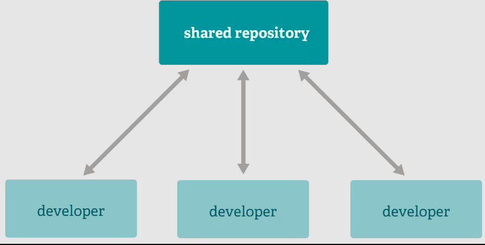


**Integration Manager**
Tạm dịch là **tích hợp quản lý**, kiểu này hịn và chuyên nghiệp hơn.

Nhưng hình ảnh trên trang chủ của Git mô tả hơi khó hiểu, mình tạm chế nhanh ra từ bức ảnh bên, vẽ online cho nhanh, nhìn cũng xấu phết, kaka.
https://git-scm.com/about/distributed 
- "Sao chép" repository về kho của mình, gọi là `fork repo`
- `Clone` fork repo từ kho về máy tính cá nhân.
- Sau khi chỉnh sửa, `push` trạng thái mới lên fork repo.
- Tạo bản so sánh giữa 2 branch của 2 repo, gọi là `pull request`, gửi cho người quản lý có quyền merge code mới vào, sẽ có demo sau.

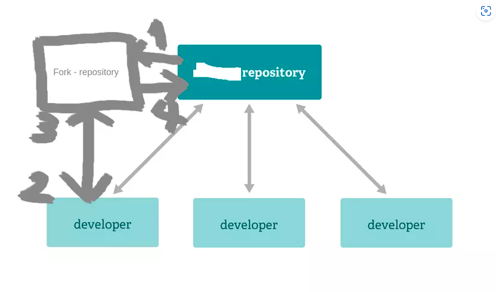

#### Data Assurance
**Git đảm bảo tính toàn vẹn của dữ liệu.**
- Mọi thứ trong Git được `"băm" (checksum or hash)` trước khi lưu trữ và được tham chiếu tới bằng mã băm đó.
- Có nghĩa là việc thay đổi nội dung của một tập tin hay một thư mục mà Git không biết tới là điều không thể.
- Chức năng này được xây dựng trong Git ở tầng thấp nhất, bạn không thể mất thông tin/dữ liệu trong khi truyền tải hoặc nhận về một tập tin bị hỏng mà Git không phát hiện ra.
- Cơ chế mà Git sử dụng cho việc băm này được gọi là mã băm SHA-1. Đây là một chuỗi được tạo thành bởi 40 ký tự của hệ cơ số 16 (0-9 và a-f) và được tính toán dựa trên nội dung của tập tin hoặc cấu trúc thư mục trong Git.

#### Staging Area :
Đây là một **khu vực trung gian** mà commit có thể được định dạng và xem lại trước khi hoàn thành.

Mỗi tập tin trong Git được quản lý dựa trên ba trạng thái: committed, modified, và staged.
- ***Staged*** là bạn đã đánh dấu sẽ commit phiên bản hiện tại của một tập tin đã chỉnh sửa trong lần commit sắp tới.
- ***Modified*** có nghĩa là bạn đã thay đổi tập tin nhưng chưa commit vào cơ sở dữ liệu.
- ***Committed*** có nghĩa là dữ liệu đã được lưu trữ một cách an toàn trong cơ sở dữ liệu.

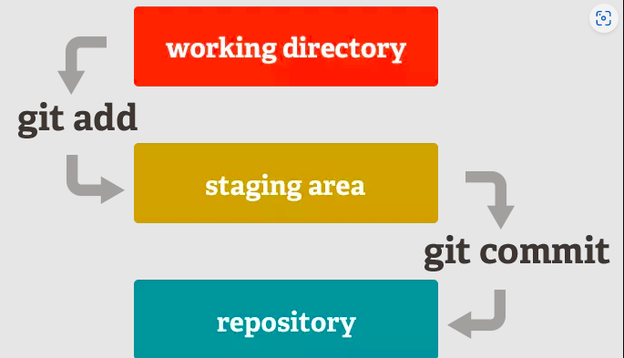


Nôm na như này:
- Các file mà chưa được add vào staging area thì Git nó hông quan tâm, chỉ khi nào bạn dùng lệnh `add`, chuyển file vào staging area thì nó mới quản lý.
- Khi bạn `commit` file nào thì file đó được chuyển từ staging area vào repo.

#### Free and Open Source

#### Trademark

Hai phần này mình bỏ ngỏ nhé !

## 6. Git - Documentation
Hình ảnh bên dưới là trang documentation của Git, gồm 4 phần:
- `Reference`: Giới thiệu rất chi tiết từng câu lệnh của Git.
- `Book`: Phần này giới thiệu nội dung cuốn Pro Git, nếu đọc hết cuốn này thì bạn sẽ cứng kịa về Git rồi đó.
- `Video`: Một vài video tham khảo
- `External Links`: Một vài liên kết có liên quan.


Nhưng chúng ta sẽ không đi theo follow trên. Để ngắn gọn và đơn giản hơn, thì lần lượt sẽ là:

### 6.1 Cài đặt Git
Cũng không khó khăn lắm, các bạn tham khảo ở mục download trên trang chủ của Git nhé !
https://git-scm.com/downloads

### 6.2 Tools
**Tools:**
- Thuần túy nhất thì các bạn làm việc với `command line` trên Terminal của Linux hoặc Cmd của Windows.
- Bên cạnh đó thì có các GUI hỗ trợ như SourceTree, Git Desktop; một số editor như PHP storm hoặc Ruby Mine cũng có tích hợp.
https://git-scm.com/downloads/guis
- Ngày mới ban đầu tiếp cận với Git thì mình dùng GUI và chúa ghét bác nào dùng command line. Kiểu ra vẻ, thích tỏ ra nguy hiểm, đã có GUI để thao tác click chuột trên cho đơn giản, tiết kiệm thời gian rồi mà còn bày đặt.
- Nhưng bây chừ thì mình chỉ dùng command line, cảm thấy khi đó mình sẽ hiểu rõ bản chất vấn đề hơn, tùy biến được nhiều hơn, giải quyết mọi thứ theo ý mình. GUI thì nó cũng base từ command mà ra.
- Hôm nọ mình làm cùng dự án với ông anh, thấy mình dùng Git trên command line, anh ấy bảo mình vài câu, đại ý cũng như mình hồi còn dùng Git trên GUI, mình chỉ lặng cười nhẹ thôi, biết nói gì bây chừ.
- Kể ra thì đôi khi cũng có nhiêu cái hay, gặp điều gì mình không thích thì cũng phản ứng bình từ thôi, có thể có lý do nào đấy.

**Server:**

- Có một số nhà cung cấp như GitHub, BitBucket, GitLab.
- Cá nhân thì mình và phần lớn đồng nghiệp đều thấy GitHub hỗ trợ người dùng tốt nhất, chức năng ổn định, giao diện dễ nhìn, thao tác đơn giản.
- Sau đây, mình sẽ hướng dẫn các bạn làm việc với command line trên Ubuntu và sử dụng server GitHub nhé.
- Có một lưu ý là nếu dùng command line trên Ubuntu thì bạn nên cài Zsh, tối ưu nó một chút, cài thêm plugin auto_suggest để thuận tiện hơn, tham khảo bài viết của mình tại đây
https://viblo.asia/p/bot-lay-loi-hieu-ro-hon-toi-uu-su-dung-phim-tat-cho-terminal-ORNZqowM50n

### 6.3 SSH key
Với Git, nếu bạn sử dụng **giao thức HTTPS** để truyền tải dữ liệu giữa server và client thì mỗi lần bạn pull hay push đều cần phải nhập lại email và mật khẩu GitHub, vậy hãy dùng giao thức SSH như sau:
- Gõ câu lệnh sau vào Terminal:
```
ssh-keygen -t rsa -C "hoanki2212@gmail.com"
```
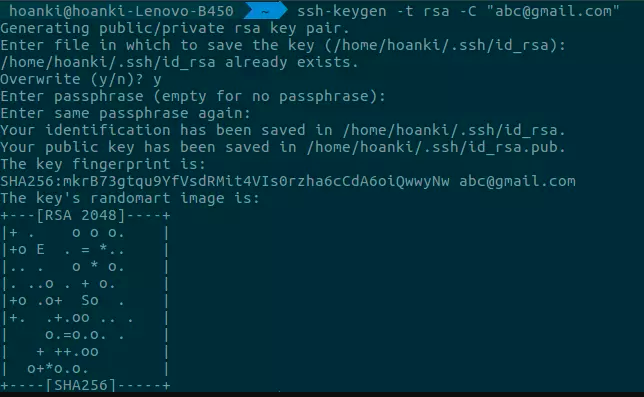

- Câu lệnh trên sẽ sinh ra một `public key` và một `private key`
    - `Private key` thì tuyệt đối đừng chia sẻ
    - `Public key`thì share nó với github.
- Bạn sẽ thấy dòng chữ: `Your public key has been saved in:` + path. Theo path đó, mở file và copy public key.
- Đăng nhập vào GitHub -> Setting -> SSH and GPG keys -> Add new SSH key
- Điền public key và nhấp okie, từ giờ bạn có thể dùng giao thức SSH được rồi.


### Updating ...
Phần 1 này chủ yếu giới thiệu về lý thuyết:
Để mình cùng nhau hiểu hơn Git là gì và bản chất của phần mềm này đã.
Trong quá trình viết bài mình cần tìm hiểu thêm nhiều và cũng nhận ra nhiều điều mới.
Nếu có ý kiến đóng góp gì, bạn vui lòng comment bên dưới nhé !

Trong phần 2 chúng ta sẽ:

Cùng tìm hiểu rõ hơn các câu lệnh.
Và áp dụng Git vào dự án thực tế như thế nào nhé.
###############################################

## Flow cơ bản khi sử dụng Git

Sau đây là flow cơ bản khi bạn sử dụng Git:
- `Clone` (pull?) project từ server về Local Repository
- Check-out 1 nhánh từ Local Repository về Working Space
- Bạn sẽ làm việc (thêm, sửa, xoá tại Working Space)
- `Add` : xác nhận sự thay đổi của các files (đưa đến vùng Staging Area)
- `Commit`: cập nhật sự thay đổi lên Local Repository
Về cơ bản đến đây là bạn đã hoàn thành 1 chu trình sử dụng Git. Lúc này, nếu như bạn muốn cập nhật sự thay đổi này lên server thì bạn sẽ dùng lệnh push để đẩy chúng lên server.

## Những câu lệnh cơ bản thường sử dụng
### Thiết lập chứng thực cá nhân
```
$ git config --global user.name "User Name"
$ git config --global user.email "username@gmail.com"
```
Lưu ý: --global được sử dụng để áp dụng cho tất cả các projects. Nếu bạn ko sử dụng --global thì settings sẽ chỉ dùng cho riêng project đó.

### Tạo một kho chứa Git
`$ git init`

Nếu như bạn muốn theo dõi một dự án cũ trong Git, bạn cần ở trong thư mục của dự án đó. Lệnh này sẽ ***tạo một thư mục mới có tên .git, thư mục này chứa tất cả các tập tin cần thiết cho kho chứa***.

### Sao chép một kho chứa đã tồn tại
```
$ git clone https://github.com/user/repository.git
```

Câu lệnh trên sẽ tạo một thư mục mới có tên giống trên của repo.

### Nhánh trong git
Khi sử dụng Git, bạn có thể tạo ra nhiều nhánh (branch) khác nhau. Câu lệnh Git này dùng để kiểm tra branch hiện tại:
```
$ git branch
```
Để tạo mới một branch:
```
 $ git branch <name_branch>
```

Để chuyển và tạo mới:
```
 $ git checkout -b <name_branch>
```

###  Chuyển nhánh
Trước khi muốn thay đổi source code, điều đầu tiên mà bạn cần phải làm là checkout một nhánh. Để checkout một nhánh, bạn dùng câu lệnh Git sau:
```
$ git checkout <name_branch>
```

###  Cập nhật thay đổi
Sau khi bạn thay đổi source code: thêm mới, sửa, xoá files,… Bạn cần phải cập nhật lên Staging Area. Để cập nhật hết các files:
```
$ git add .
```

Sau lệnh add, bạn cần sử dụng câu lệnh Commit để đây thông tin thay đổi lên Local Respository:
```
$ git commit -m "Message"
```

###  Cập nhật lên server
Sau câu lệnh Commit, thông tin mới chỉ được cập nhật lên Local Repository. Nếu muốn cập nhật lên server thì bạn phải sử dụng câu lệnh push:
```
$ git push origin <name_branch>
```

Ngoài ra, nếu chưa tồn tại remote trên server thì bạn cần phải add mới một remote trước rồi mới push:
```
$ git remote add origin <remote_url>
$ git push origin <name_branch>
```

###  Gộp nhánh
Sau một thời gian cập nhật các file và push lên git trên branch mới, bây giờ mình cần ghép (merge) code lại vào nhánh gốc (master). Trước tiên, cần phải checkout ra khỏi branch hiện tại cần gộp để vào branch master, sau đó thì dùng lệnh merge để ghép branch mới vào master:
```
$ git checkout master
$ git merge <new_branch>
```

###  Xem lại lịch sử commit
```
$ git log
```

Lệnh git log sẽ cho bạn biết về người commit, ngày giờ, message của những lần commit đó.

###  Xem thay đổi trước khi push
```
$ git diff
```
Lệnh này giúp bạn biết những gì đã được thay đổi giữa nhánh hiện tại và nhánh trước nó.

###  Gộp commit
```
$ git rebase -i HEAD~
```

Sau dấu ~ là số commit bạn muốn gộp. Sau khi gõ lệnh này một cửa sổ trình soạn thảo hiện ra. Thay đổi ký tự pick của dòng các dòng sau dòng đầu thành s rồi lưu lại/kết thúc. Khi đó, trình soạn thảo để chỉnh sửa giải thích commit thiết lập cho commit sau khi đã tổng hợp sẽ được hiển thị, nên hãy chỉnh sửa lưu lại/kết thúc.

###  Pull từ remote repository
```
$ git pull origin master
```

Lệnh trên sẽ gộp những thay đổi mới kéo về từ máy chủ từ xa với nhánh hiện tại trên máy local.

## Tổng kết
Trong bài viết này mình đã giới thiệu khái quát về Git và đưa ra những câu lệnh cơ bản mà bạn thường xuyên phải dùng nó. Mình mong bài viết này có thể giúp ích cho các bạn mới bắt đầu sử dụng git có thể tham khảo, hiểu được một phần nào đó về git và vận dụng tốt vào việc sử dụng của các bạn. Tiếp theo, mình sẽ giới thiệu một số trường hợp gặp phải khi sử dụng git Một số trường hợp trong git
https://viblo.asia/p/mot-so-truong-hop-khi-su-dung-git-3Q75w1x7ZWb 
---> chua paste... kha chi tiet